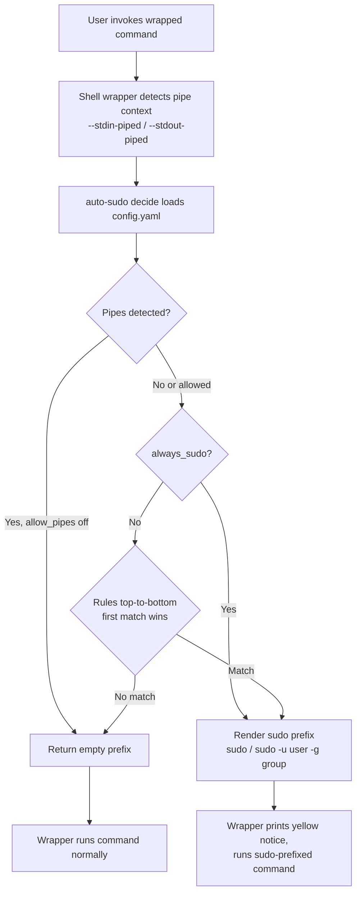

# Architecture - auto-sudo

## Overview

auto-sudo is a Rust CLI that generates shell wrappers and decides whether a
command should be prefixed with `sudo` based on YAML rules or command-level
`always_sudo` settings. The wrapper calls `auto-sudo decide`, receives a prefix,
prints a yellow notice when sudo will be used, then invokes the real command.
A companion `sudoers` subcommand generates checksum-pinned `NOPASSWD` entries
under `/etc/sudoers.d/` so the resulting escalation is passwordless.

## Design

Decision order is fixed: **pipe policy → always_sudo → rules**. Within a rule,
path filters (`paths`/`path_prefixes`/`path_suffixes`) gate the access,
ownership, and group checks; `any_file` needs one file to pass all checks,
`all_files` needs every extracted file to pass. Missing files never satisfy
access checks (`current_user_cannot_*`) — only parent-directory checks
(`missing_parent_not_*`) can match a non-existent path, so creating a file in a
writable directory never escalates.

→ *File-format details live in [PROJ-SCHEMA.md](PROJ-SCHEMA.md)*

## Components

| Component | Purpose |
|-----------|---------|
| `rust/src/main.rs` | CLI entrypoint and subcommands (clap) |
| `rust/src/config.rs` | YAML config model and default path resolution |
| `rust/src/decision.rs` | Rule matching, argument extraction, permission checks, prefix rendering |
| `rust/src/shell.rs` | Bash/zsh wrapper generation |
| `rust/src/sudoers.rs` | sudoers snippet generation, write/toggle/refresh/check |
| `auto-sudo.zsh` | Small loader that evals generated zsh wrappers |
| `config.example.yaml` | Default example preserving legacy behavior (YAML anchors shared rule bodies) |

→ *Components ↔ directories: see [PROJ-LAYOUT.md](PROJ-LAYOUT.md)*

## Key Design Decisions

- **CLI decides, shell executes**: `auto-sudo decide` only prints a prefix (`sudo `, `sudo -u <user> [-g <group>] `, or empty). It never executes the target command.
- **Config-driven behavior**: Commands, command-level always-sudo behavior, file arguments, flags, pipe policy, and sudo target users are YAML data.
- **Fail closed on config errors**: Wrapper generation and decision calls return non-zero if config cannot be parsed.
- **Pipes denied by default**: `allow_pipes` must be enabled globally or per command to auto-sudo in pipelines — even `always_sudo` commands stay un-sudoed when piped.
- **Checksum-pinned sudoers**: generated `NOPASSWD:` lines carry a `sha256:<base64>` digest constraint (sudoers digest syntax) plus an `# AUTO-SUDO ENTRY id=...` header used by `toggle` to comment/uncomment individual entries.
- **sudoers writes are explicit and validated**: snippets print by default; `write`/`refresh` go through a temp file, `visudo -cf` validation, and atomic rename. `--append` merges with existing content; `toggle` comments entries in place.
- **Missing ≠ unreadable**: a non-existent file in a writable directory is treated as creatable by the user, so read/edit rules do not escalate for it (prevents spurious sudo for `cat /tmp/new-file`).

## Install Model

`make install` compiles the Rust crate (`cargo build --release`), copies the
binary to `~/.local/bin/auto-sudo`, installs the zsh loader to
`~/.local/share/auto-sudo/`, seeds `~/.config/auto-sudo/config.yaml` from
`config.example.yaml` (never overwriting an existing config), and appends a
source line to `~/.zshrc` if absent.

## Ecosystem Fit

auto-sudo lives in the Noizu Infra monorepo as a git submodule with a dual
path — `Portfolio/Utilities/source/auto-sudo` (source) and `utilities/` (the
install-oriented mirror) — but is a standalone Rust project, not a shell
script: it has its own `Makefile` and is installed directly via `make install`
in this directory rather than through the repo-root `make install-utilities`
flow. It does not source `share/k8-lib/` and reads no `.infra-config.yaml` —
its only configuration surface is `~/.config/auto-sudo/config.yaml`. It shares
the ecosystem convention of installing user tooling into `~/.local/bin`.

## Extensibility

Add commands and rules to `~/.config/auto-sudo/config.yaml`. Supported file
argument selectors include positional indexes, `position: any`, `--flag=value`,
and `--flag value`. File checks can match permission state, ownership, group
membership, exact/wildcard paths, prefixes, and suffixes.
