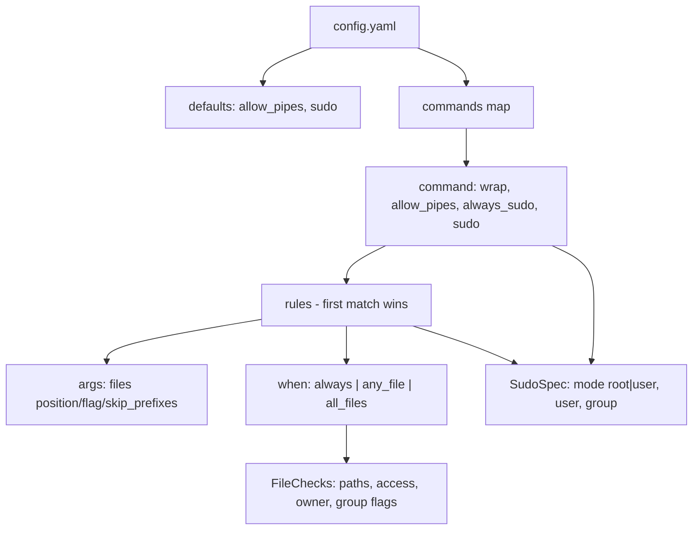

# Schema Summary

> **No persistence layer** — no DB/SQL schema. Data artifacts are files: YAML
> config (consumed), sudoers.d snippet + shell wrappers (generated). Details:
> [PROJ-SCHEMA.md](PROJ-SCHEMA.md).

## Artifacts

| Artifact | Kind | Key structure |
|----------|------|---------------|
| `~/.config/auto-sudo/config.yaml` | input | `version` + `defaults` (allow_pipes, sudo) + `commands` map |
| `/etc/sudoers.d/auto-sudo` | generated | `# AUTO-SUDO ENTRY id=...` header + `<subject> ALL=(runas) NOPASSWD: sha256:<digest> <path>` |
| shell wrappers | generated | one zsh/bash function per `wrap: true` command; calls `auto-sudo decide` |
| `~/.zshrc` source line | install-time | added by `make install` |

## config.yaml shape



- Rule evaluation: top to bottom, **first match wins**; `always_sudo` bypasses rules but still respects pipe policy.
- SudoSpec resolution: rule → command → defaults → root.
- FileChecks: 17 boolean flags + 3 path-filter lists (wildcard `paths`, prefixes, suffixes).

## sudoers entry grammar

```
# AUTO-SUDO ENTRY id=<cmd>-<target> command=<cmd> path=<abspath> checksum=sha256:<b64> [dev= ino= mtime=]
<subject> ALL=(<user[:group]>) NOPASSWD: sha256:<b64> <abspath>
```

- `id` = sanitized command + target (`root` or sudo user); dedupe key.
- Toggle `--off` comments the rule line (`# ` prefix); `--on` uncomments.
- Writes validated with `visudo -cf` before atomic rename; `--append` vs replace.

## CLI

```
decide [--config] [--explain] [--stdin-piped] [--stdout-piped] -- <cmd> [args...]
shell [--shell zsh|bash] [--config]
sudoers print|write|refresh|toggle|check   (write/refresh: --file --command... --append; toggle: <id> --on|--off; default --file /etc/sudoers.d/auto-sudo)
```
