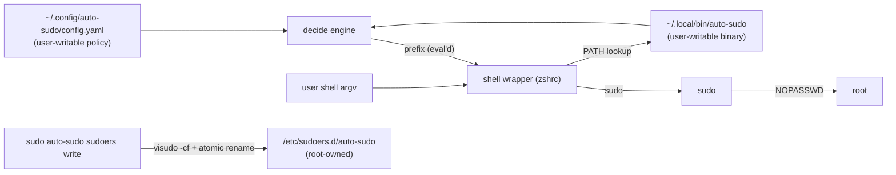

# Threat Model — auto-sudo

## Overview

auto-sudo is a **single-user, local privilege-escalation helper**: it decides
per-invocation whether a wrapped command should run under `sudo`, and
generates `NOPASSWD` sudoers entries so that escalation is passwordless. It
has **no network surface** — no listeners, no HTTP, no remote input. The one
trust boundary that matters is **user process ↔ root**: the tool's entire
security posture is about who can influence what gets escalated, and what a
granted sudoers entry actually allows.

Crown jewels: `/etc/sudoers.d/auto-sudo` (the generated grant file) and
`~/.config/auto-sudo/config.yaml` (the policy that generates it).

Grounding: components and data flow in [PROJ-ARCH.md](PROJ-ARCH.md); file
locations in [PROJ-LAYOUT.md](PROJ-LAYOUT.md); artifact formats in
[PROJ-SCHEMA.md](PROJ-SCHEMA.md).

## Attack Surface

All ingress is local: config file, argv, environment (`$USER`), and PATH.

## Vulnerability Register

| ID | Severity | STRIDE | Component | Status |
|----|----------|--------|-----------|--------|
| T-001 | High | Elevation | sudoers entries | Accepted (residual) |
| T-002 | Medium | Tampering | config.yaml | Partial |
| T-003 | Medium | Elevation | `sudoers_subject()` | Open (hardening) |
| T-004 | Low | Tampering | decide → exec race | Accepted |
| T-005 | Low | Spoofing | PATH resolution | Mitigated (checksums) |
| T-006 | Low | Info disclosure | wrapper notice | Accepted |

### T-001 — NOPASSWD grants are argument-unconstrained

Sudoers lines pin the binary (path + sha256 digest) but not its arguments.
Any granted command becomes a potential passwordless root shell vector —
classically `vim` via `:!sh`. **Accepted**: single-user workstation where the
user already holds sudo rights; the tool removes the password prompt, not the
privilege. Users should treat every `always_sudo`/rule grant as "passwordless
root for this binary, any args."

### T-002 — Policy input is user-writable

Any process running as the user can rewrite `config.yaml` so that a later
user-initiated `sudo auto-sudo sudoers write` installs broader grants than
the user intended. Checksum pinning does not help (it pins binaries, not
policy). **Partial**: the control is review — `sudoers print` before `write`,
and the managed-file header makes entries auditable (`sudoers check`,
`toggle --off` to disable individually).

### T-003 — Subject fallback widens to ALL

`sudoers_subject()` (`rust/src/sudoers.rs`) uses `$USER` and falls back to
`ALL` when unset. In interactive shells this is benign, but a write performed
from an environment without `USER` (cron, launchd, some CI shells) produces
entries granting **every local user** NOPASSWD access to the pinned binaries.
**Open**: hardening would error (or require an explicit `--subject`) instead
of silently widening. Interim mitigation: never run `sudoers write` from
contexts that strip `USER`.

### T-004 — TOCTOU between decide and execution

File checks run in `decide`; the sudo exec happens later in the wrapper.
State can change in between. **Accepted**: the same race exists with manual
sudo usage; the window is per-invocation and local.

### T-005 — PATH resolution of decide and targets

The wrapper invokes `auto-sudo` via PATH, and `resolve_command` resolves bare
command names via `which` at sudoers-generation time. A same-user attacker can
shadow either. **Mitigated for the escalated binary**: sudoers entries pin the
absolute path and `sha256:<base64>` digest, so a swapped binary fails sudo's
digest check. A shadowed `decide` can only choose among prefixes the existing
sudoers entries already permit — it cannot create new grants.

### T-006 — Wrapper notice prints argv

The yellow `Auto Sudo <cmd> <args>` notice writes the full argument list to
stderr, which may embed tokens passed on the command line. **Accepted**:
notice is the deliberate consent signal; stderr of the user's own terminal.

## Mitigation Coverage

2 mitigated · 2 partial · 1 open (T-003) · 3 accepted residuals.

| Mitigation | Covers | Where |
|------------|--------|-------|
| `visudo -cf` validation + atomic rename before any write/append | corrupt/arbitrary sudoers writes, self-lockout | `sudoers.rs::write_checked` |
| sha256 digest constraint on every `NOPASSWD` line | binary replacement/swap (T-005) | `sudoers.rs::checksum` |
| `shell_word()` quoting of user/group in the rendered prefix | shell injection via config into the wrapper's `eval` | `decision.rs::render_prefix` |
| Missing ≠ unreadable file semantics | spurious escalation for creatable files | `decision.rs` |
| Fail-closed on config parse errors | wrapper never guesses on bad config | all subcommands |

## Residual Risk

Passwordless sudo for pinned binaries with unrestricted args (T-001) is the
core design trade-off: convenience over an authentication prompt, on a
single-admin workstation. The open item worth fixing before any multi-user
use is T-003; on a shared host, T-001 and T-003 together would be disqualifying.
